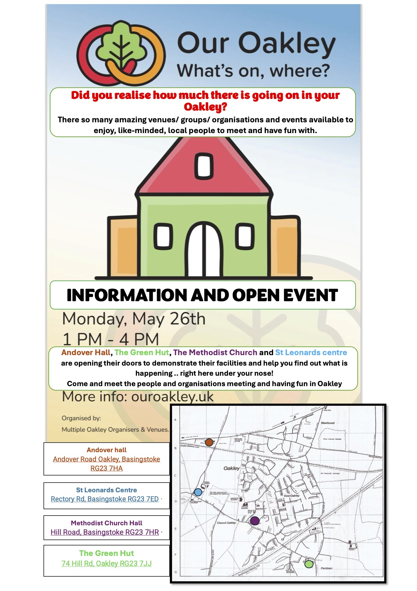

Did you realise how much there is going on in your Oakley?

There so many amazing venues/ groups/ organisations and events available to enjoy, like-minded, local people to meet and have fun with.

INFORMATION AND OPEN EVENT

\--

Andover Hall, The Green Hut, The Methodist Church and St Leonards centre are opening their doors to demonstrate their facilities and help you find out what is happening .. right here under your nose!

Come and meet the people and organisations meeting and having fun in Oakley

\--

Andover Hall - Andover Road, RG23 7HA (Junction of Andover Road & Station Road)

St Leonards Centre - Rectory Road, RG23 7HR (Junction of Station Road & Rectory Road)

The Green Hut - 74 Hill Road, RG23 7JJ

The Methodist Church - Hill Road, RG23 7HR (By the pond)
